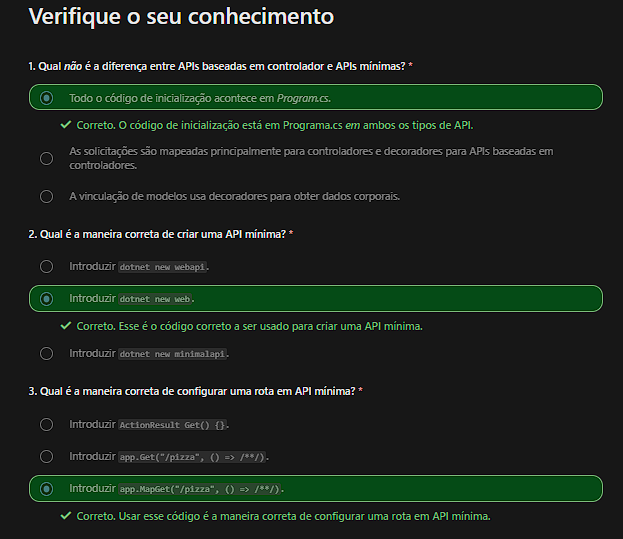

# Criar uma API usando um prototipo de API mínima
### What's the difference between the controller-based approach and minimal API?

> Streamlined Program.cs: The template for the controller-based web API wires up the controllers using the AddControllers method. In addition, it wires up Swagger to provide OpenAPI support. Minimal APIs don't have this wiring by default, though you can add Swagger if you wish.

> Routing looks a little different: The routing looks slightly different compared to a controller-based web API. In a web API, for routing you write code as shown:

```PowerShell
dotnet new web
```
```C#
app.UseRouting();
app.UseEndpoints(endpoints =>
{
    endpoints.MapControllers();
    // add my own routes
});
```

- With minimal API, you add the route right away on the app instance:

```C#
app.MapGet("/todos", await (TodoDb db) => db.Todos.ToListAsync());
app.MapPost("/todos", await (Todo todo) => {});
app.MapPut("/todos", (Todo todo) => {});
app.MapDelete("/todos/{id}", (int id) => {});
```
- Também é possível usar a instância app para adicionar middleware. Veja um exemplo de como você usaria uma funcionalidade como o CORS:

```code
    app.UseCors("some unique string");
```
    O middleware geralmente é um código que intercepta a solicitação e executa verificações como a autenticação ou que garante que o cliente tenha permissão de executar essa operação de acordo com o CORS. Após a execução do middleware, a solicitação real é feita. Os dados são lidos ou gravados no repositório, e uma resposta é enviada de volta ao cliente de chamada.

- app.Run() inicia a sua API e a faz escutar solicitações do cliente.

# Documentação Swagger

#### O Swagger implementa a especificação OpenAPI.

    Este formato descreve suas rotas, mas também os dados aceitos e produzidos. A interface do usuário do Swagger é uma coleção com ferramentas que renderizam a especificação OpenAPI como um site e permitem que você interaja com sua API por meio desse site.

- Instalando Swagger

    - Terminal
    ```csharp
    // terminal:
        dotnet add package Swashbuckle.AspNetCore --version 6.1.4
    ```
    - Code:
    ```csharp
    //namespace
    using Microsoft.OpenApi.Models;
    //
    builder.Services.AddEndpointsApiExplorer();

    //Esse método configura informações de cabeçalho em sua API, como o que é chamado e o número da versão.
    builder.Services.AddSwaggerGen(c =>
    {
        c.SwaggerDoc("v1", new OpenApiInfo { Title = "Todo API", Description = "Keep track of your tasks", Version = "v1" });
    });

    //Essas duas linhas de código informarão ao projeto de API para usar o Swagger e também onde encontrar o arquivo de especificação swagger.json.
    app.UseSwagger();
    app.UseSwaggerUI(c =>
    {
        c.SwaggerEndpoint("/swagger/v1/swagger.json", "Todo API V1");
    });
    ```


# Verbos HTTP

| Verbo HTTP  | Descrição                         |
| ----------- | -----------                       |
| GET         | Retorna Dados                     |
| POST        | Envia Dados que Criam um Recurso  |
| PUT         | Envia Dados que atualizam Recurso |
| Delete      | Remove Recurso                    |

                 Um recurso é a peça de um dado. Por exemplo, ele pode ser um produto, um usuário ou um pedido. É algo que você provavelmente vai operar e para o qual deseja gerenciar o ciclo de vida.

### GET - Buscar um Recurso
- Somente rota : Quando não se usa o id
    ```c#
    app.MapGet("/products", () => data); 
    ```

- Rota e parametro de rota : quando se especifica o registro que se quer receber
    ```c#
    app.MapGet("/products/{id}", (int id) => data.SingleOrDefault(product => product.Id == id));
    ```

### POST - Criar um Recurso

```c#
app.MapPost("/products", (Product product) => /**/);
```

- Precisamos de um JSON 

    ```json
    {
    "Name" : "New product",
    "Description": "a description"
    }
    ```
- Para receber esse JSON precisamos de uma instancia de objeto que corresponda as chave-valor do JSON acima.
    ```c#
    public record Product(int Id, string Name);
    ```

### PUT - Atualizar um recurso
> Necessita de um corpo semantico que possa ser enviado para modificar algum dado já armazenado em memória, ou não faz sentido querer mudar algo que ainda não existe como um recurso.

- Uso:
    ```c#
    app.MapPut("/products", (Product product) => /* Update the data store using the `product` instance */);
    ```

### DELETE - Remover um Recurso
> Para que se faça um delete é necessário o envio de um dado/recurso que, ao compara-lo com um identificador único, case com o dado/recurso que já está em memória.

- Uso:
    ```c#
    app.MapDelete("/products/{id}", (int id) => /* Remove the record whose unique identifier matches `id` */);
    ```

## Requisição e Respostas - Exemplos
> Baseado na estrutura se responde com dados serializados em JSON

- Requisição:
    ```c#
    app.MapGet("/products", () => products);
    app.MapGet("/products/{id}", (int id) => products.SingleOrDefault(product => product.Id == id));
    app.MapGet("/product", () => new { id = 1 });
    ```
- Respostas:
    ```json
    // app.MapGet("/products", () => products);
    [{
    "id": 1,
    "name": "a product"
    }, {
    "id": 2,
    "name": "another product"
    }]
    // app.MapGet("/products/{id}", (int id) => products.SingleOrDefault(product => product.Id == id));
    [{
    "id": 1,
    "name": "a product"
    }]
    // app.MapGet("/product", () => new { id = 1 });
    {
    "id": 1
    }
    ```
# Verificação de Conhecimento


# Resumo

Resumo retirado de: [Microsoft Api Minimal](https://learn.microsoft.com/pt-pt/training/modules/build-web-api-minimal-api/7-summary)

> Neste módulo, você aprendeu como criar uma API usando o modelo de API mínima para .NET 8.
>
> A API mínima permite que você crie uma API com apenas algumas linhas de código. Ele tem todos os principais recursos que você está acostumado a gostar de injeção de dependência, falar com bancos de dados e gerenciamento de rotas. Uma API mínima difere de uma API baseada em controlador porque você especifica explicitamente as rotas necessárias em vez de confiar em uma abordagem baseada em convenção, como com uma API baseada em controlador.
>
> Esta abordagem apresenta muitas vantagens:
>
> Mais fácil de começar: com quatro linhas de código, você pode ter uma API pronta e funcionando rapidamente.
Aprimoramento progressivo: adicione recursos quando precisar deles. Até lá, o código do programa permanece pequeno.
Recursos mais recentes do .NET 8: use todos os recursos mais recentes do .NET 8, como instruções e registros de nível superior.
Como parte deste módulo, você aprendeu como adicionar Swagger. Você também adicionou rotas para criar, ler, atualizar e excluir um recurso.
>


---------------------------------------

# Entity Framework

> O EF Core é uma tecnologia de acesso a dados leve, extensível, de código aberto e de plataforma cruzada para aplicativos .NET.
> 
> O EF Core pode servir como um mapeador relacional de objeto, que:
> 
> - Permite que os desenvolvedores do .NET trabalhem com um banco de dados usando objetos .NET.
>
> - Elimina a necessidade da maior parte do código de acesso a dados que normalmente precisa ser gravado.
>
> O EF Core dá suporte a um grande número de bancos de dados populares, incluindo SQLite, MySQL, PostgreSQL, Oracle e Microsoft SQL Server.

## Adicionando EF Core In Memory ao Projeto
- Terminal:
    ```PowerShell
    # EF Core in Memory:
    dotnet add package Microsoft.EntityFrameworkCore.InMemory
    ```

- Código:
    ```cs
        builder.Services.AddDbContext<PizzaDbContext>(options => options.UseInMemoryDatabase("items"));
    ```

> Observação: A persistencia de dados em memória é perdido quando o aplicativo é reiniciado.

## Adicionando EF Core com provedor de banco de dados SQLite ao Projeto

- Terminal:
    ```PowerShell
    # EF Core SQLite:
    dotnet add package Microsoft.EntityFrameworkCore.Sqlite

    # EF Core Toools
    # tarefas de desenvolvimento em tempo de design
    dotnet tool install --global dotnet-ef

    # Logica de tempo de design para o EF Core
    dotnet add package Microsoft.EntityFrameworkCore.Design
    ```
- Habilitando a criacao do banco de dados:

    ```cs
    var connectionString = builder.Configuration.GetConnectionString("Pizzas") ?? "Data Source=Pizzas.db";
    ```
    ```diff
    - builder.Services.AddDbContext<PizzaDb>(options => options.UseInMemoryDatabase("items"));
    + builder.Services.AddSqlite<PizzaDb>(connectionString);
    ```
- Usando os comandos do EF Core Tools para criar Migrations:
    ```PowerShell
    # Primeira migration
    dotnet ef migrations add InitialCreate

    #Criando o banco de dados e o Esquema:
    dotnet ef database update
    ```